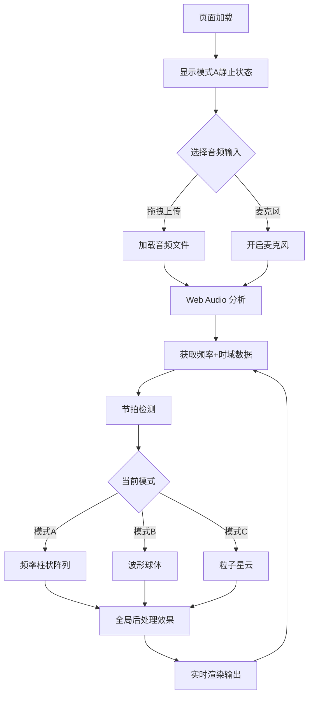

## 1. 产品概述

基于Three.js与Web Audio API的3D音频可视化器，将音频数据实时转化为震撼的三维视觉体验。用户可通过拖拽上传本地音频文件或使用麦克风输入，系统实时分析频率与时域数据，驱动三种风格迥异的可视化模式。

- 目标用户：音乐爱好者、VJ视觉艺术家、音频开发者
- 核心价值：将抽象音频转化为沉浸式3D视觉，支持多种艺术风格切换

## 2. 核心功能

### 2.1 功能模块

1. **主页面**：3D可视化画布、音频上传区域、控制面板

### 2.2 页面详情

| 页面名称 | 模块名称 | 功能描述 |
|---------|---------|---------|
| 主页面 | 音频输入区 | 拖拽上传音频文件/麦克风按钮，无音频时显示上传提示 |
| 主页面 | 3D可视化画布 | 三种可视化模式(A/B/C)的3D渲染区域，全屏画布 |
| 主页面 | 控制面板 | 模式切换、灵敏度调节、配色主题、全屏、帧率显示 |

## 3. 核心流程

用户打开页面 → 看到模式A静止状态 → 拖拽上传音频或开启麦克风 → 音频分析启动 → 3D可视化随音频跳动 → 可随时切换模式/调节参数/更换配色

## 4. 用户界面设计

### 4.1 设计风格

- 主色调：深黑背景(#0a0a0f)，霓虹色系强调色
- 按钮风格：半透明毛玻璃质感，霓虹边框发光
- 字体：Orbitron（科技感显示字体）+ Source Sans 3（UI正文）
- 布局：全屏3D画布 + 左下角浮动控制面板
- 图标：线性极简风格（lucide-react）

### 4.2 页面设计概览

| 页面名称 | 模块名称 | UI元素 |
|---------|---------|--------|
| 主页面 | 3D画布 | 全屏WebGL画布，深黑背景，初始显示静态圆形柱状阵列 |
| 主页面 | 上传区 | 中央拖拽区域，虚线边框，脉冲动画提示，拖入时高亮 |
| 主页面 | 控制面板 | 左下角毛玻璃面板，模式按钮组A/B/C，灵敏度滑块，主题选择器，全屏按钮，FPS计数器 |

### 4.3 响应式

- 桌面优先设计，3D画布自适应窗口尺寸
- 控制面板在小屏幕时可收起/展开

### 4.4 3D场景指引

- 环境：无环境光贴图，纯黑背景配发光粒子/柱体
- 灯光：环境光+点光源随音频脉动
- 相机：透视相机，轻微随节拍摇晃，距离可调
- 构图：视觉元素居中，环形排列
- 交互：模式切换时平滑过渡动画
- 后处理：Bloom发光、色差(Chromatic Aberration)、噪点(Noise)强度随音量联动
- 性能预算：60fps目标，粒子数量控制在5000以内
