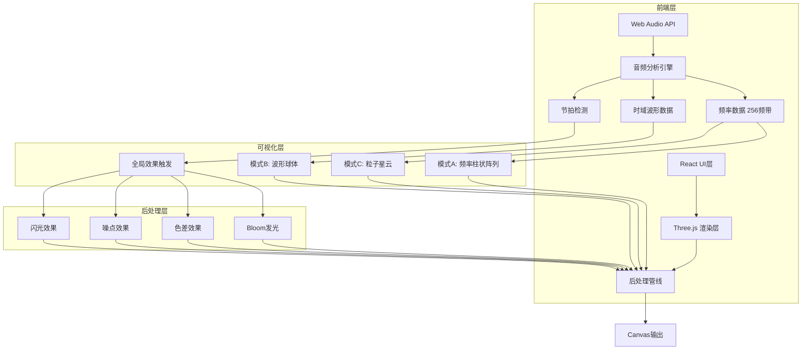

## 1. 架构设计



## 2. 技术说明

- 前端：React@18 + TypeScript + Three.js + tailwindcss@3 + Vite
- 初始化工具：vite-init (react-ts模板)
- 3D渲染：Three.js (直接使用，配合自定义Shader)
- 后处理：Three.js EffectComposer (UnrealBloomPass, ShaderPass)
- 音频：Web Audio API (AnalyserNode, AudioContext)
- 状态管理：Zustand
- 后端：无
- 数据库：无

## 3. 路由定义

| 路由 | 用途 |
|------|------|
| / | 主页面，包含3D可视化画布与控制面板 |

## 4. 核心模块设计

### 4.1 音频分析模块 (AudioAnalyzer)

- AudioContext + AnalyserNode，fftSize=512获取256频带
- getByteFrequencyData() 获取频率数据
- getByteTimeDomainData() 获取时域波形数据
- 节拍检测：跟踪音量峰值，当瞬时音量超过移动平均值1.5倍时判定为节拍
- 提供统一数据接口：frequencyData, timeDomainData, volume, beat, dominantFrequency

### 4.2 可视化模式A - 频率柱状阵列 (FrequencyBars)

- 128根柱体圆形排列，半径5
- 柱体高度随对应频率振幅跳动(0-8范围)
- 颜色渐变：低频蓝(#0044ff) → 中频绿(#00ff88) → 高频红(#ff4400)
- 柱体顶部粒子弹射效果：粒子从柱顶发射，随重力下落
- 使用InstancedMesh优化128根柱体渲染

### 4.3 可视化模式B - 波形球体 (WaveformSphere)

- IcosahedronGeometry(半径3, 细分4次)作为基础球体
- 顶点沿法线方向偏移，偏移量由时域波形数据驱动
- 球体颜色随音量强度变化：暗(#111133) → 亮(#6644ff)
- 金属反射质感：MeshStandardMaterial, metalness=0.8, roughness=0.2
- 环境贴图使用PMREMGenerator生成

### 4.4 可视化模式C - 粒子星云 (ParticleNebula)

- 4000粒子球形分布，使用BufferGeometry + Points
- 低频 → 径向膨胀(粒子沿径向移动)
- 高频 → 旋转加速(粒子绕Y轴旋转)
- 残影效果：不清除上一帧，使用半透明黑色覆盖
- 节拍爆发：检测到节拍时粒子速度突增，向外扩散
- 粒子使用自定义Shader实现发光效果

### 4.5 全局效果模块 (PostProcessing)

- EffectComposer管线：RenderPass → UnrealBloomPass → ShaderPass(色差) → ShaderPass(噪点)
- Bloom强度：0.5 + volume * 1.5
- 色差偏移量：volume * 0.003
- 噪点强度：volume * 0.08
- 背景颜色：HSL色相随主频率缓慢变化
- 相机摇晃：节拍时相机位置偏移，使用阻尼回弹
- 闪光效果：节拍时全屏白色闪烁，快速衰减

### 4.6 控制面板 (ControlPanel)

- 模式切换：A/B/C三个按钮，当前模式高亮
- 灵敏度调节：滑块(0.5x - 3.0x)，控制频率数据放大系数
- 配色主题：霓虹(Neon)/极光(Aurora)/火焰(Flame)/海洋(Ocean)
- 全屏切换：Fullscreen API
- 帧率显示：实时FPS计数器

### 4.7 配色主题定义

| 主题 | 低频色 | 中频色 | 高频色 | 背景色 | 强调色 |
|------|--------|--------|--------|--------|--------|
| 霓虹 | #0044ff | #00ff88 | #ff4400 | #0a0a1a | #ff00ff |
| 极光 | #00ccaa | #44ffcc | #aaffee | #050510 | #88ffdd |
| 火焰 | #ff2200 | #ff8800 | #ffdd00 | #0a0500 | #ff4400 |
| 海洋 | #003366 | #0066cc | #00aaff | #000510 | #00bbff |

## 5. 文件结构

```
src/
├── main.tsx                    # 入口
├── App.tsx                     # 根组件
├── index.css                   # 全局样式
├── store/
│   └── useStore.ts             # Zustand状态管理
├── hooks/
│   └── useAudioAnalyzer.ts     # 音频分析Hook
├── components/
│   ├── VisualizerCanvas.tsx     # Three.js画布容器
│   ├── ControlPanel.tsx         # 控制面板UI
│   ├── DragUpload.tsx           # 拖拽上传组件
│   └── FPSCounter.tsx           # 帧率显示
├── visualizations/
│   ├── FrequencyBars.ts         # 模式A：频率柱状阵列
│   ├── WaveformSphere.ts        # 模式B：波形球体
│   ├── ParticleNebula.ts        # 模式C：粒子星云
│   └── PostProcessing.ts        # 后处理效果管线
└── themes/
    └── themes.ts                # 配色主题定义
```
